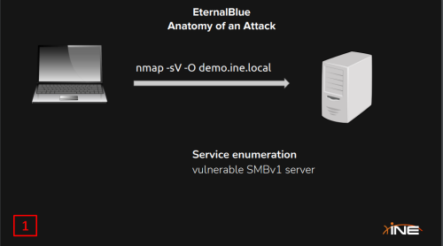

# EternalBlue - MS17-010 (CVE-2017-0143)

EternalBlue is a computer exploit developed by the U.S. National Security Agency (NSA). It was leaked by the [Shadow Brokers](https://en.wikipedia.org/wiki/The\_Shadow\_Brokers) hacker group on April 14, 2017, one month after Microsoft released patches for the vulnerability.

On May 12, 2017, the worldwide [WannaCry ransomware](https://en.wikipedia.org/wiki/WannaCry\_ransomware) used this exploit to attack unpatched computers. On June 27, 2017, the exploit was again used to help carry out the [2017 NotPetya cyberattack](https://en.wikipedia.org/wiki/2017\_NotPetya\_cyberattack) on more unpatched computers.

The exploit was also reported to have been used since March 2016 by the Chinese hacking group [Buckeye (APT3)](https://en.wikipedia.org/wiki/Advanced\_persistent\_threat#APT\_groups), after they likely found and re-purposed the tool,  as well as reported to have been used as part of the Retefe banking trojan since at least September 5, 2017.

EternalBlue was among the several exploits used, in conjunction with the [DoublePulsar](https://en.wikipedia.org/wiki/DoublePulsar) [backdoor](https://en.wikipedia.org/wiki/Backdoor\_\(computing\)) implant tool, in executing the [2017 WannaCry attacks](https://en.wikipedia.org/wiki/WannaCry\_ransomware\_attack).

> The SMBv1 server in Microsoft Windows Vista SP2; Windows Server 2008 SP2 and R2 SP1; Windows 7 SP1; Windows 8.1; Windows Server 2012 Gold and R2; Windows RT 8.1; and Windows 10 Gold, 1511, and 1607; and Windows Server 2016 allows remote attackers to execute arbitrary code via crafted packets, aka "Windows SMB Remote Code Execution Vulnerability." This vulnerability is different from those described in CVE-2017-0143, CVE-2017-0145, CVE-2017-0146, and CVE-2017-0148.

[https://www.exploit-db.com](https://www.exploit-db.com/exploits/42315)  - search "MS17-010" or "EternalBlue".

[https://www.exploit-db.com/download/41896](https://www.exploit-db.com/download/41896)  - how to exploit eternalblue (pdf).

[https://www.cvedetails.com/cve/CVE-2017-0143/](https://www.cvedetails.com/cve/CVE-2017-0143/)  - CVE details.

[https://nvd.nist.gov/vuln/detail/cve-2017-0144](https://nvd.nist.gov/vuln/detail/cve-2017-0144)  - the NIST NVD info on the eternalblue vuln.

[https://nmap.org/nsedoc/scripts/smb-vuln-ms17-010.html](https://nmap.org/nsedoc/scripts/smb-vuln-ms17-010.html) - nmap script to check for EB vuln.

<figure><figcaption>
run nmap scan to detect smb version
</figcaption></figure>

<figure><figcaption></figcaption></figure>

<figure><figcaption></figcaption></figure>

